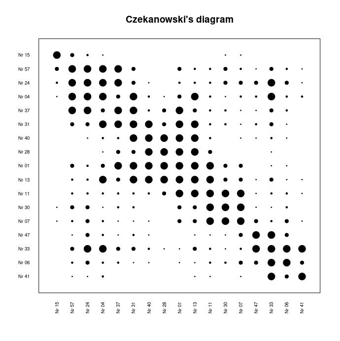

# learnrlang
Exercises in the R language

Test RMaCzek library (https://cran.r-project.org/package=RMaCzek)

Function to load data from an mdt file (MaCzek 3.3) to data.frame.

Czekanowski's diagram, data from slabosz.mdt:

